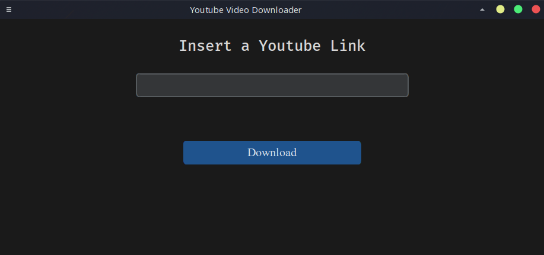
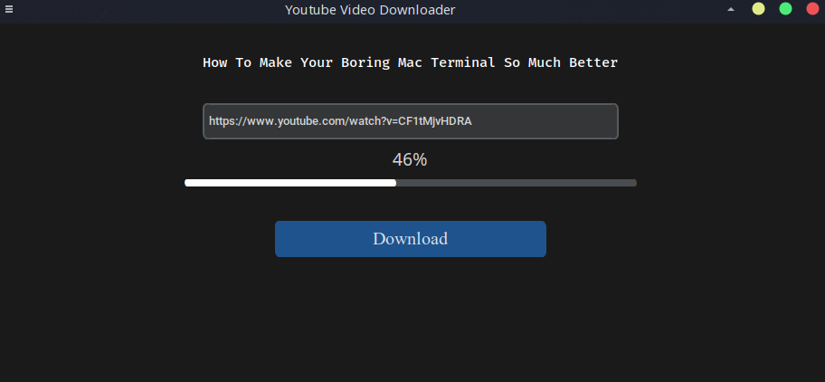
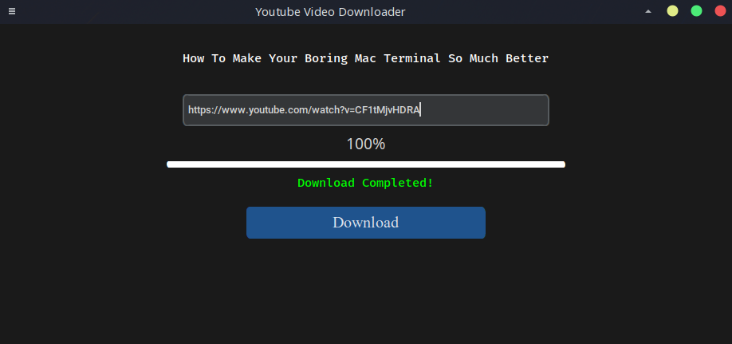
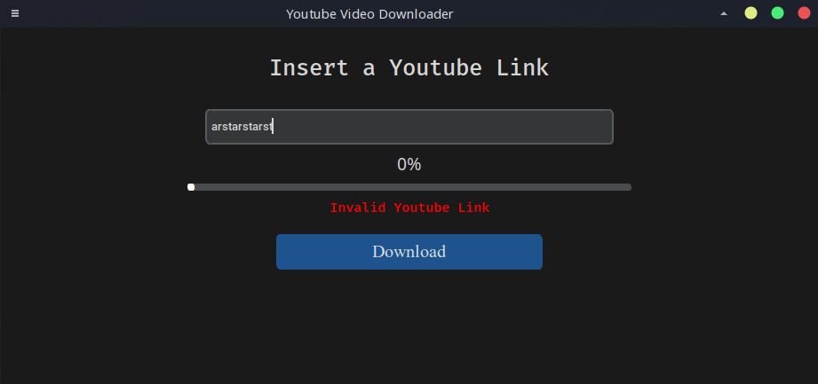

# Youtube Video Downloader

Playing around with tkinter and its wrapper CustomTkinter to create a modern GUI to download any youtube video whose link is provided.

## Functionality

Download videos from youtube for a link without age restrictions provided the link and open the downloaded file
in the associated media player.
(In my case vlc in linux).

### Technology used

* python
* tkinter
* customtkinter
* pytube
* subprocess

## Project show case

